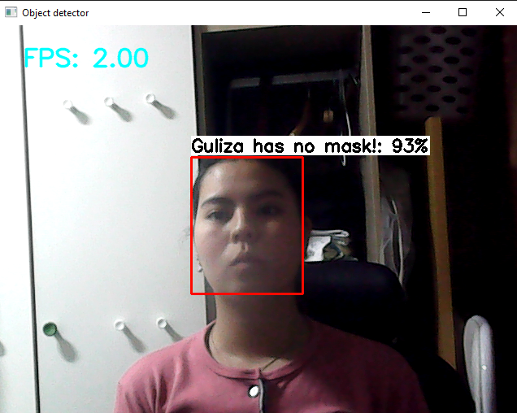

# Mask Detection and Face Recognition
This is the final project for IOT class at Inha University. In this project we have implemented mask detection and face recognition models and deployed them on Raspberry Pi3.

## Installation and Quickstart
1. First create python virtual environment:   
    ```
    python -m venv iot_env
    ```
2. Activate the environment:
    ```
    source iot_env/bin/activate
    ```
3. Go to project directory and install requirements:
    ```
    pip install -r requirements.txt
    ```
4. Install additional library:
    ```
    python3 -m pip install tflite-runtime
    ```
5. Run the code:
    ```
    python TFLite_detection_webcam.py --modeldir TFLite_model
    ```

## Demo


# -----------------------------------------------------------------
# Mask Detector with TFLite Object Detection API in Microcontroller

This project using python 3.6

## Raspberry Pi 4

1. `cd mask-detector`
2. `workon mask`
3. Comment the opencv-python in requirements.txt
4. `pip install -r requirements.txt`
5. `python TFLite_detection_webcam.py --modeldir=TFLite_model`

## In Desktop

1. `cd mask-detector`
2. activate venv
3. `pip install requirements.txt`
4. `python TFLite_detection_webcam.py --modeldir=TFLite_model`

## Cite

TFLite_model is made by https://github.com/wangyifan411/Face-Mask-Type-Detector
